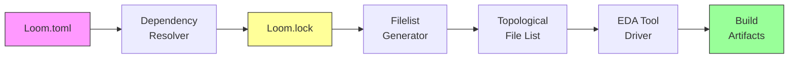
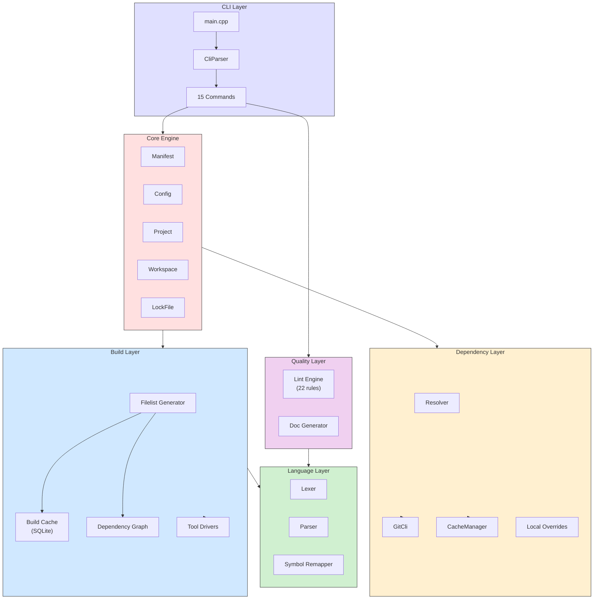
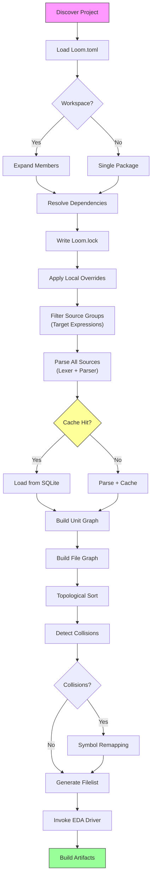
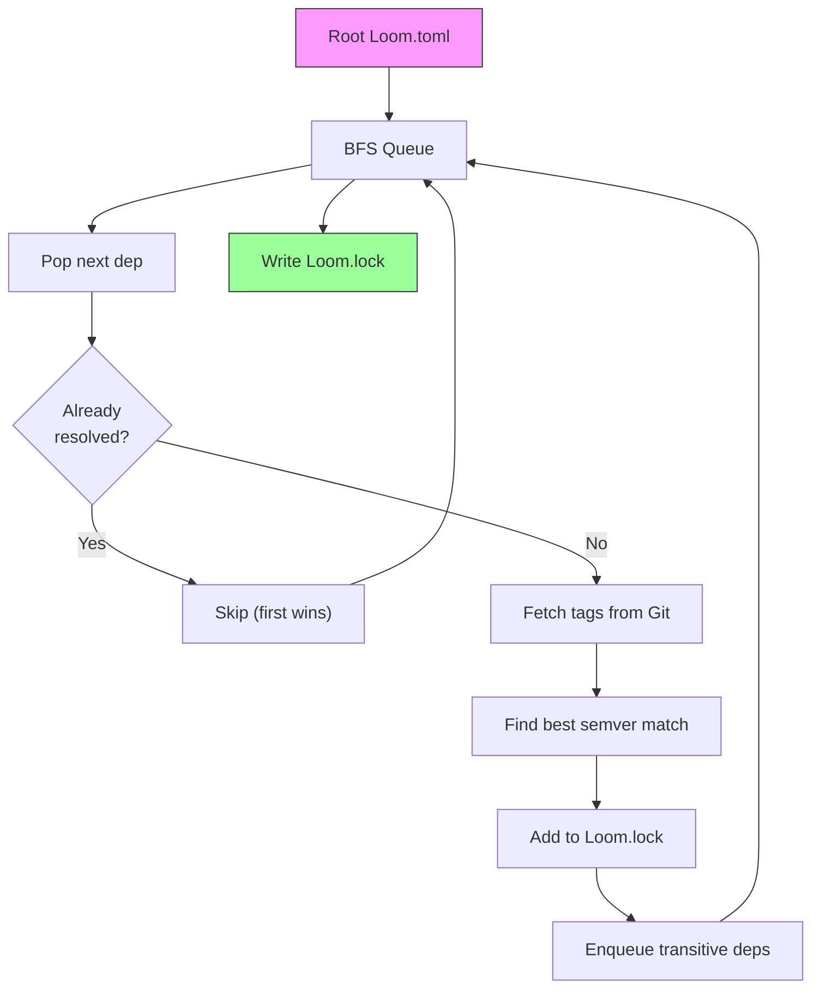
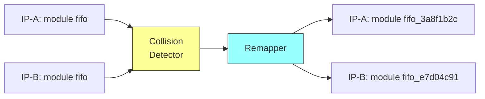

# Loom

**A package manager and build system for Verilog and SystemVerilog.**

Loom manages reusable HDL IP cores across projects, resolves transitive
dependencies from Git, generates topologically-sorted file lists for any EDA
tool, and provides built-in linting and documentation generation — all from a
single `Loom.toml` file.

```
$ loom new soc_top && cd soc_top
$ loom lock
  Resolving 12 dependencies...
  Locked 12 packages in 0.34s

$ loom build --target sim
  Filelist: 47 files, top module: soc_top
  Running: verilator --binary -Wall ...
  Build complete (3.2s)
```

---

## Table of Contents

- [Features](#features)
- [Installation](#installation)
- [Quick Start](#quick-start)
- [Architecture](#architecture)
- [Manifest Format (`Loom.toml`)](#manifest-format-loomtoml)
- [Commands](#commands)
- [Dependency Management](#dependency-management)
- [Target Expressions](#target-expressions)
- [EDA Tool Drivers](#eda-tool-drivers)
- [Lint Engine](#lint-engine)
- [Documentation Generation](#documentation-generation)
- [Symbol Remapping](#symbol-remapping)
- [Workspaces](#workspaces)
- [Local Overrides (`Loom.local`)](#local-overrides-loomlocal)
- [Building from Source](#building-from-source)
- [Performance](#performance)
- [License](#license)

---

## Features

| Feature | Description |
|---------|-------------|
| **Git-Direct Dependencies** | No registry required. Depend on any Git repo or local path. |
| **Transitive Resolution** | BFS first-to-resolve-wins strategy (matches Cargo/npm semantics). |
| **Topological Filelists** | Automatic compile-order generation from parsed design units. |
| **10 EDA Tool Drivers** | Built-in support for Icarus, Verilator, Vivado, Quartus, ModelSim, VCS, Xcelium, Yosys, + custom. |
| **22-Rule Lint Engine** | AST-based linting with suppression comments and naming conventions. |
| **Doc Generation** | Markdown documentation from `///` comments with Mermaid diagrams. |
| **Symbol Remapping** | Automatic namespace collision resolution across IP cores. |
| **Workspace Support** | Cargo-style monorepo with shared lockfile and dependency inheritance. |
| **Local Overrides** | `Loom.local` for developer-specific dependency overrides, gitignored. |
| **Incremental Build Cache** | SQLite-backed content-addressed cache for parse results and file stats. |
| **Target Expressions** | Boolean filter grammar (`all()`, `any()`, `not()`) for conditional source groups. |
| **Cross-Platform** | Linux, macOS (Intel + Apple Silicon), and Windows. |

---

## Installation

### Linux / macOS

```bash
curl -sSL https://raw.githubusercontent.com/KyleWang02/loom/main/install.sh | sh
```

Detects your OS and architecture automatically. Installs to `/usr/local/bin`
(or `~/.local/bin` as fallback). Pin a specific version with:

```bash
LOOM_VERSION=v0.1.0 curl -sSL .../install.sh | sh
```

### Windows

```powershell
irm https://raw.githubusercontent.com/KyleWang02/loom/main/install.ps1 | iex
```

Installs to `%LOCALAPPDATA%\loom\bin` and adds it to your user PATH.

### From Source

See [Building from Source](#building-from-source).

### Verify

```bash
loom --version
# loom 0.1.0
```

---

## Quick Start

```bash
# 1. Create a new project
loom new my_chip
cd my_chip

# 2. Add a dependency (edit Loom.toml)
#    [dependencies]
#    uart = { git = "https://github.com/org/uart.git", tag = "v1.0.0" }

# 3. Resolve and lock dependencies
loom lock

# 4. View the dependency tree
loom tree

# 5. Simulate
loom test --wave

# 6. Lint your code
loom lint

# 7. Generate documentation
loom doc
```

---

## Architecture

### High-Level Pipeline



### Component Map



### Build Pipeline (Detail)



---

## Manifest Format (`Loom.toml`)

Every Loom project has a `Loom.toml` at its root:

```toml
[package]
name = "soc_top"
version = "1.0.0"
authors = ["Jane Doe"]
top = "soc_top"                   # Optional: top-level module name

[dependencies]
axi_crossbar = { git = "https://github.com/org/axi.git", tag = "v2.1.0" }
uart         = { git = "https://github.com/org/uart.git", version = "^1.0" }
spi          = { path = "../spi_ip" }

[[sources]]
files = ["src/**/*.sv", "src/**/*.v"]
include_dirs = ["include/"]
defines = ["SYNTHESIS"]

[[sources]]
target = "any(simulation)"
files = ["tb/**/*.sv"]
defines = ["TB_MODE"]

[targets.sim]
tool = "verilator"
action = "simulate"
[targets.sim.options]
waveform = true
waveform_format = "fst"
compile_args = ["--timing", "-Wall"]

[targets.synth]
tool = "vivado-synth"
action = "synthesize"
[targets.synth.options]
device = "xc7a35ticsg324-1L"

[lint]
blocking-in-ff = "error"
unused-signal = "off"

[lint.naming]
module = "[a-z][a-z0-9_]*"
parameter = "^[A-Z][A-Z0-9_]*$"
```

### Dependency Specifiers

Each dependency requires exactly one source and (for git) one version pin:

| Source | Pin | Example |
|--------|-----|---------|
| `git` | `tag` | `{ git = "https://...", tag = "v1.0.0" }` |
| `git` | `version` | `{ git = "https://...", version = "^2.0" }` |
| `git` | `rev` | `{ git = "https://...", rev = "abc123" }` |
| `git` | `branch` | `{ git = "https://...", branch = "main" }` |
| `path` | — | `{ path = "../local_ip" }` |
| `workspace` | — | `{ workspace = true }` |
| `member` | — | `{ member = true }` |

Version constraints follow semver: `^1.2.3` (compatible), `~1.2.3` (patch-only), `>=1.0, <2.0`, `1.2.*`.

---

## Commands

### Overview

```
loom <command> [options]

Project:
  new <name>        Scaffold a new Loom project
  init              Initialize Loom in current directory
  info              Display project metadata
  env               Show environment and detected EDA tools
  config            View or set configuration

Dependencies:
  lock              Resolve dependencies, write Loom.lock
  update [pkg]      Re-resolve and fetch dependencies
  fetch             Alias for update
  tree              Print dependency tree
  clean             Remove build cache or .loom/

Build:
  build             Build with an EDA tool
  test              Run simulation (alias for build --simulate)
  plan              Generate file list only

Quality:
  lint [files...]   Lint Verilog/SystemVerilog sources
  doc               Generate documentation from source comments
```

### Global Flags

| Flag | Short | Description |
|------|-------|-------------|
| `--verbose` | `-v` | Increase verbosity (repeatable: `-vvv`) |
| `--help` | `-h` | Print help |
| `--version` | | Print version |
| `--no-local` | | Ignore `Loom.local` overrides |
| `--offline` | | No network access; use cached repos only |
| `--target` | `-t` | Active target expression |

### Build / Test

```bash
# Auto-detect EDA tool and build
loom build

# Use a named target from Loom.toml
loom build --target sim

# Simulate with waveform dumping
loom test --wave --wave-format fst

# Build specific packages in a workspace
loom build -p uart -p spi

# Pass extra flags to the EDA tool
loom build -- --timing --trace-fst
```

| Flag | Description |
|------|-------------|
| `--target NAME` | Select target configuration from `[targets.*]` |
| `-p PKG` | Build specific package (repeatable) |
| `--all` | Build all workspace members |
| `--wave` | Enable waveform dumping |
| `--wave-format FMT` | Waveform format: `vcd`, `fst`, `fsdb` |
| `--no-local` | Suppress `Loom.local` overrides |

### Lint

```bash
# Lint all project sources
loom lint

# Lint specific files
loom lint src/alu.sv src/decoder.sv

# Filter to specific rules
loom lint --rule blocking-in-ff --rule mixed-blocking

# JSON output for CI integration
loom lint --format json

# Strict mode: exit 1 on any warning
loom lint --strict
```

### Doc

```bash
# Generate Markdown docs (default: docs/api/)
loom doc

# HTML docs to a custom directory
loom doc --format html -o build/docs

# Clean previous output and open in browser
loom doc --clean --open
```

---

## Dependency Management

### Resolution Strategy



- **BFS first-to-resolve wins**: the closest-to-root declaration takes precedence
  (matches Cargo/npm semantics)
- **Single lockfile**: `Loom.lock` is deterministic and committed to version control
- **Two-tier Git cache**: bare repos in `.loom/cache/git/db/`, working trees in
  `.loom/cache/git/checkouts/`

### Cache Structure

```
.loom/
├── cache/
│   ├── git/
│   │   ├── db/              # Bare repos (shared across versions)
│   │   └── checkouts/       # Working trees per commit
│   └── loom_cache.db        # SQLite build cache
├── build/                   # EDA tool output artifacts
└── Loom.lock                # (at project root)
```

---

## Target Expressions

Source groups in `[[sources]]` can be conditionally included using boolean
target expressions. Active targets are set via `--target` on the CLI.

### Grammar

```
expr   ::= 'all(' expr (',' expr)* ')'
         | 'any(' expr (',' expr)* ')'
         | 'not(' expr ')'
         | IDENT
         | '*'
```

### Examples

```toml
[[sources]]
target = "all(simulation, not(verilator))"
files = ["tb/non_verilator_model.sv"]

[[sources]]
target = "any(synthesis, fpga)"
files = ["src/fpga_wrapper.v"]

[[sources]]
target = "*"    # Always included
files = ["src/common.v"]
```

```bash
# Activate simulation + verilator targets
loom build --target "simulation,verilator"
```

---

## EDA Tool Drivers

Loom ships with 10 built-in drivers and supports custom tool definitions.

### Built-In Drivers

| Driver | Tool | Actions | Binary |
|--------|------|---------|--------|
| `icarus` | Icarus Verilog | Lint, Simulate | `iverilog` / `vvp` |
| `verilator` | Verilator | Lint, Simulate | `verilator` |
| `vivado-sim` | Vivado Simulator | Simulate | `xvlog` / `xelab` / `xsim` |
| `vivado-synth` | Vivado Synthesis | Synthesize, Build | `vivado` |
| `quartus` | Intel Quartus | Synthesize, Build | `quartus_sh` |
| `modelsim` | Mentor ModelSim | Simulate | `vlog` / `vsim` |
| `vcs` | Synopsys VCS | Simulate | `vcs` / `simv` |
| `xcelium` | Cadence Xcelium | Simulate | `xrun` |
| `yosys` | Yosys | Synthesize | `yosys` |
| `custom` | User-defined | Any | Configurable |

### Auto-Detection

When no `--target` is specified, Loom searches your PATH for available tools
in priority order and selects the first match.

### Custom Driver

```toml
[targets.my-tool]
tool = "custom"
action = "simulate"
[targets.my-tool.options]
build_cmd = "my_compiler {{ files }} -top {{ top_module }} -o {{ output }}"
run_cmd = "./{{ output }}"
```

Template variables: `{{ files }}`, `{{ top_module }}`, `{{ output }}`,
`{{ defines }}`, `{{ include_dirs }}`.

---

## Lint Engine

Loom includes a 22-rule static analysis engine that operates on the parser AST.
All rules produce GCC-compatible output and can be configured per-project.

### Rules Reference

#### Correctness

| Rule ID | Default | Description |
|---------|---------|-------------|
| `blocking-in-ff` | Error | Blocking assignment (`=`) inside `always_ff` |
| `nonblocking-in-comb` | Error | Non-blocking assignment (`<=`) inside `always_comb` |
| `mixed-blocking` | Error | Both `=` and `<=` in the same always block |
| `case-missing-default` | Warn | `case` without `default` branch (unless `unique`) |
| `casex-usage` | Warn | `casex` used (prefer `casez` or `case...inside`) |
| `always-star` | Warn | `always @(*)` (prefer `always_comb`) |
| `defparam-usage` | Warn | Deprecated `defparam` statement |
| `implicit-net` | Warn | File lacks `` `default_nettype none `` |
| `duplicate-module` | Error | Two design units with the same name |

#### Structure

| Rule ID | Default | Description |
|---------|---------|-------------|
| `label-mismatch` | Warn | End label doesn't match begin label |
| `unlabeled-generate` | Warn | Generate block without a label |
| `ifdef-balance` | Error | Unmatched `` `ifdef ``/`` `endif `` |
| `one-module-per-file` | Off | Multiple modules in a single file |
| `module-filename-match` | Off | Module name doesn't match filename |
| `unused-signal` | Warn | Signal declared but never read |
| `undriven-signal` | Warn | Signal read but never assigned |

#### Style (off by default, regex-configurable)

| Rule ID | Default Pattern | Description |
|---------|----------------|-------------|
| `naming-module` | `[a-z][a-z0-9_]*` | Module naming convention |
| `naming-signal` | — | Signal naming convention |
| `naming-parameter` | `[A-Z][A-Z0-9_]*` | Parameter naming convention |

### Configuration

```toml
[lint]
blocking-in-ff = "error"     # "off", "warn", or "error"
unused-signal = "off"

[lint.naming]
module = "[a-z][a-z0-9_]*"   # Regex pattern
parameter = "^[A-Z_]+$"
```

### Suppression

```verilog
// loom: ignore[blocking-in-ff]
assign q = d;                    // This line is suppressed

assign x = y;  // loom: ignore[unused-signal]   (same-line)

// loom: ignore[*]               // Suppress ALL rules on next line
assign z = w;
```

### Output

**Text (default):**
```
src/alu.sv:42:5: error: [blocking-in-ff] blocking assignment in always_ff block
src/alu.sv:87:1: warning: [unused-signal] signal 'temp' is declared but never read
```

**JSON (`--format json`):**
```json
{
  "diagnostics": [
    {
      "file": "src/alu.sv",
      "line": 42,
      "col": 5,
      "severity": "error",
      "rule": "blocking-in-ff",
      "message": "blocking assignment in always_ff block"
    }
  ],
  "summary": { "errors": 1, "warnings": 1 }
}
```

---

## Documentation Generation

Loom extracts documentation from `///` comments placed before design units.

### Comment Syntax

```verilog
/// A simple UART transmitter.
///
/// Sends 8N1 serial data at the configured baud rate.
///
/// @param CLK_FREQ   System clock frequency in Hz
/// @param BAUD_RATE  Target baud rate
/// @port  clk        System clock
/// @port  tx         Serial transmit line
/// @see   uart_rx
/// @deprecated Use uart_v2 instead
module uart_tx #(
    parameter CLK_FREQ  = 50_000_000,  /// System clock frequency
    parameter BAUD_RATE = 115200       /// Baud rate
)(
    input  logic clk,     /// System clock
    input  logic rst_n,   /// Active-low reset
    input  logic [7:0] data,
    input  logic valid,
    output logic tx,      /// Serial output
    output logic ready
);
```

### Supported Tags

| Tag | Description |
|-----|-------------|
| `@param NAME` | Parameter description |
| `@port NAME` | Port description |
| `@see NAME` | Cross-reference to another unit |
| `@deprecated MSG` | Deprecation notice |
| `@example` | Code example block |
| `@note` | Informational note |
| `@warning` | Warning callout |
| `@wavedrom` | WaveDrom timing diagram (JSON) |

### Output

```bash
loom doc                    # Markdown to docs/api/
loom doc --format html      # HTML output
loom doc -o build/docs      # Custom output directory
```

Generated structure:

```
docs/api/
├── index.md                 # Project index with module list
├── modules/
│   ├── uart_tx.md           # Per-module pages
│   └── soc_top.md
├── interfaces/
│   └── axi_if.md
├── packages/
│   └── common_pkg.md
└── search_index.json        # Machine-readable index
```

Each page includes: description, parameter table, port table, dependency
graph (Mermaid), cross-references, and examples.

---

## Symbol Remapping

When multiple IP cores define identically-named modules, Loom detects the
collision and automatically renames conflicting units:



- Mangled name: `original_name` + `_` + first 8 hex chars of SHA-256(`file_path:name`)
- All instantiations and imports are updated to match
- Transparent: no manual intervention required

---

## Workspaces

Workspaces let you manage multiple related IP cores in a single repository
with a shared lockfile.

### Root `Loom.toml`

```toml
[workspace]
members = ["ip/*", "soc/top"]
exclude = ["ip/deprecated"]
default-members = ["soc/top"]

[workspace.dependencies]
common_cells = { git = "https://github.com/org/common.git", tag = "v1.0" }
```

### Member `ip/uart/Loom.toml`

```toml
[package]
name = "uart"
version = "1.0.0"

[dependencies]
common_cells = { workspace = true }    # Inherits from root
spi = { member = true }               # Sibling member reference
```

### Workspace Commands

```bash
loom lock              # Resolve all members
loom build -p uart     # Build a single member
loom build --all       # Build everything
loom test -p uart -p spi  # Test multiple members
```

A single `Loom.lock` at the workspace root ensures all members use consistent
dependency versions.

---

## Local Overrides (`Loom.local`)

Create a `Loom.local` file (gitignored) to temporarily swap dependencies
during development without modifying `Loom.toml` or `Loom.lock`:

```toml
[overrides]
uart = { path = "../uart-dev" }
axi  = { git = "git@github.com:me/axi-fork.git", branch = "bugfix" }
```

| Command | Behavior |
|---------|----------|
| `loom build` | Overrides applied |
| `loom test` | Overrides applied |
| `loom tree` | Overrides shown |
| `loom lock` | Overrides **ignored** (lockfile reflects `Loom.toml` only) |
| `loom build --no-local` | Overrides suppressed |

---

## Building from Source

### Requirements

- CMake 3.16+
- C++17 compiler (GCC 8+, Clang 7+, MSVC 2019+)
- Git (for dependency operations at runtime)

All library dependencies are vendored:
- SQLite 3.45.0 (amalgamation)
- toml++ v3.4.0 (single header)
- Catch2 (single header, tests only)

### Build

```bash
git clone https://github.com/KyleWang02/loom.git
cd loom
cmake -B build -DCMAKE_BUILD_TYPE=Release
cmake --build build
```

### Test

```bash
ctest --test-dir build --output-on-failure
```

### Install

```bash
cmake --install build --prefix /usr/local
```

### Static Binary

```bash
cmake -B build -DCMAKE_BUILD_TYPE=Release -DLOOM_STATIC=ON
cmake --build build
# Produces a fully static, portable binary
```

---

## Performance

Benchmarked in Release mode on a modern x86_64 system:

| Operation | Input Size | Time | Target |
|-----------|-----------|------|--------|
| Lexer | 10,000 lines | 17 ms | < 100 ms |
| Lexer | 50,000 lines | 71 ms | < 500 ms |
| Parser | 10,000 lines | ~25 ms | < 200 ms |
| Graph topo sort | 10,000 nodes | < 1 ms | < 50 ms |
| Cycle detection | 10,000 nodes | < 1 ms | < 50 ms |
| Build cache stat lookup | 1 file | < 0.1 ms | — |
| Incremental check | 1,000 files (0 changed) | < 200 ms | — |

The SQLite build cache makes repeated builds near-instant when source files
haven't changed.

---

## License

See [LICENSE](LICENSE) for details.
