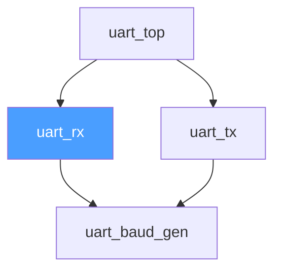
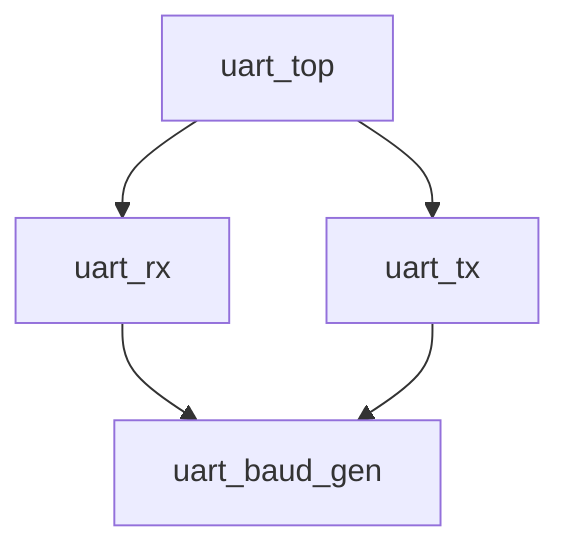
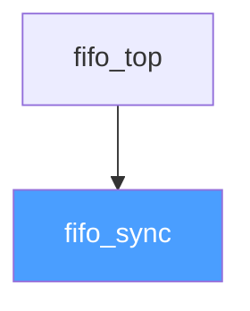

# `loom doc` -- Auto-Generated Documentation Specification

## Research Summary

This document presents a complete design specification for the `loom doc` command, based
on thorough research of existing documentation generators across languages and the HDL
ecosystem. The specification leverages the fact that Loom's parser (Phases 3-4) already
extracts the structural information needed for documentation, making this feature nearly
"free" from a data-extraction standpoint.

---

## Part 1: Research Findings

### 1.1 rustdoc (Rust)

**Doc comment syntax:**
- `///` -- outer doc comment (documents the following item)
- `//!` -- inner doc comment (documents the enclosing item)
- `/** */` and `/*! */` -- block variants of the above
- Content is Markdown (CommonMark)
- First sentence (up to `.`) automatically becomes the brief/summary

**AST extraction pipeline:**
1. Rust compiler runs up through HIR (High-Level Intermediate Representation)
2. **Clean phase** (`clean/mod.rs`): transforms HIR types into rustdoc's own `clean::*`
   types that are more stable against compiler churn
3. **Passes**: collect-trait-impls, strip-private, strip-hidden,
   collect-intra-doc-links, run-lints
4. **Render phase** (`formats/renderer/run_format`): `init` generates static files +
   search index; `item` produces per-page HTML; `after_krate` creates global resources
5. Uses Askama (Jinja-like) templates compiled at build time for HTML page structure

**Generated output:**
- Static HTML site with CSS/JS, no server required
- One HTML page per item (module, struct, function, trait, etc.)
- Search index: compact JSON with parallel arrays (`n` = names, `t` = type codes,
  `f` = function signatures, `q` = parent module paths)
- Client-side JS search with edit distance, substring matching, type-based search
- Search descriptions split into shards for lazy download

**Cross-referencing (intra-doc links):**
- `[`OtherType`]` syntax resolves to the correct HTML page using Rust's namespace system
- Three namespaces: types, values, macros -- disambiguated with prefixes like
  `[type@Foo]`, `[value@Foo]`, `[macro@Foo]`
- Links resolved in the scope of the module where the item is defined
- `LinkCollector` pass resolves all intra-doc links during documentation generation

**Key takeaways for Loom:**
- The "clean" intermediate representation is a good pattern -- decouple from parser IR
- Static search index is essential for offline HTML docs
- First-sentence-as-summary is a natural convention
- Intra-doc links via `[module_name]` is intuitive

Sources:
- [Rustdoc Overview](https://rustc-dev-guide.rust-lang.org/rustdoc.html)
- [Rustdoc Internals](https://rustc-dev-guide.rust-lang.org/rustdoc-internals.html)
- [Rustdoc Search](https://rustc-dev-guide.rust-lang.org/rustdoc-internals/search.html)
- [Intra-doc Links](https://doc.rust-lang.org/rustdoc/write-documentation/linking-to-items-by-name.html)
- [RFC 1946: Intra-doc Links](https://rust-lang.github.io/rfcs/1946-intra-rustdoc-links.html)
- [Documentation - Rust by Example](https://doc.rust-lang.org/rust-by-example/meta/doc.html)

### 1.2 Doxygen (C/C++)

**Comment syntax -- four styles:**
1. Javadoc: `/** ... */`
2. Qt: `/*! ... */`
3. C++ triple-slash: `/// ...`
4. C++ exclamation: `//! ...`

**Post-member comments (trailing):**
- `int var; //!< Brief description after member`
- `int var; ///< Brief description after member`

**Tag system:**
- `@brief` / `\brief` -- short description
- `@param name` -- parameter documentation
- `@return` -- return value documentation
- `@see` -- cross-reference
- `@file`, `@class`, `@struct`, `@fn`, `@var`, `@def` -- structural commands
- `@defgroup` / `@ingroup` -- grouping mechanism

**Brief description extraction:**
- Explicit `@brief` tag
- Auto-brief: first sentence ending in `.`, `?`, or `!` (with `JAVADOC_AUTOBRIEF`)

**Output formats:**
- HTML (browsable, searchable)
- LaTeX (for PDF generation)
- RTF (Word)
- XML (machine-readable)
- Man pages
- CHM (Windows Help)

**Key takeaways for Loom:**
- `@param` tag for parameter documentation is universally recognized
- Trailing `///<` comments for inline port documentation are natural for HDL
- Auto-brief from first sentence is a good convention
- Grouping mechanism (`@defgroup`) could map to Loom packages

Sources:
- [Doxygen: Documenting the Code](https://www.doxygen.nl/manual/docblocks.html)
- [Doxygen: Output Formats](https://www.doxygen.nl/manual/output.html)
- [Doxygen: Features](https://www.doxygen.nl/manual/features.html)

### 1.3 Existing HDL Documentation Tools

#### Specador (AMIQ EDA) -- Commercial
- Uses dedicated language parsers for SystemVerilog, Verilog, VHDL
- Generates HTML and PDF output
- Documentation organized by language-specific concepts: packages, classes, modules
- Cross-linked: jump from function docs to arguments, module to submodules
- Auto-generates Block Diagrams, Schematic Diagrams, UML Class Diagrams
- Recognizes Markdown and reStructuredText in comments
- Always in sync with source code -- no manual diagram maintenance

#### Symbolator -- Open Source (Python)
- Parses VHDL and Verilog source files
- Extracts components/modules and renders them as symbol images
- Output formats: PNG, SVG, PDF, PS, EPS
- Parameters render as a separate gray block with inputs
- Sphinx extension available for embedding in documentation
- Requires Python 3.x, PyCairo, Pango

#### TerosHDL -- Open Source (VS Code Extension + CLI)
- Documentation comment syntax: `//!` for Verilog/SV, `--!` for VHDL
- Configurable comment marker (default `!`)
- Supports GitHub-flavored Markdown in comments
- Embeds WaveDrom timing diagrams in documentation comments
- Generates HTML and Markdown output
- Can be used from CLI for CI integration
- Extracts: module name, ports, parameters, description

#### WaveDrom -- Waveform Specification
- JSON-based format (WaveJSON) for describing digital timing diagrams
- Renders to SVG via JavaScript
- Used within documentation to show protocol timing
- Embeddable in Markdown, HTML, Sphinx
- Example: `{ signal: [{ name: "clk", wave: "P......" }] }`

#### IP-XACT (IEEE 1685)
- XML-based standard for IP metadata
- Describes: components, bus interfaces, address maps, register definitions, file sets
- Machine-readable -- designed for tool interoperability, not human documentation
- Includes HDL file references with module names and language type
- Most recent version: IEEE 1685-2022

#### Hdlparse / pyHDLParser -- Open Source (Python)
- Extracts module definitions with port and parameter lists
- Returns `VerilogModule` objects with `name`, `generics` (parameters), `ports`
- Each port/parameter is a `VerilogParameter` with name, mode, data type
- Supports Verilog 1995 and 2001 syntax
- No comment extraction for Verilog (only VHDL metacomments)
- Integration with Symbolator for diagram generation

#### verilog-doc (ben-marshall)
- Doxygen-like tool specifically for Verilog
- Parses source trees, outputs module hierarchy
- Documents module ports
- Early-stage project, C-based

Sources:
- [Specador Documentation Generator](https://eda.amiq.com/products/specador-documentation-generator)
- [Symbolator GitHub](https://github.com/kevinpt/symbolator)
- [Symbolator Docs](https://hdl.github.io/symbolator/)
- [TerosHDL GitHub](https://github.com/TerosTechnology/vscode-terosHDL)
- [TerosHDL Documenter Demo](https://github.com/TerosTechnology/teroshdl-documenter-demo)
- [WaveDrom Tutorial](https://wavedrom.com/tutorial.html)
- [WaveJSON Schema](https://github.com/wavedrom/schema/blob/master/WaveJSON.md)
- [IP-XACT Wikipedia](https://en.wikipedia.org/wiki/IP-XACT)
- [IP-XACT IEEE 1685-2022](https://ieeexplore.ieee.org/document/10054520)
- [pyHDLParser Usage](https://hdl.github.io/pyHDLParser/usage.html)
- [verilog-doc GitHub](https://github.com/ben-marshall/verilog-doc)

### 1.4 Doc Comment Conventions for Verilog/SystemVerilog

There is **no standard** for documentation comments in Verilog/SystemVerilog. The
existing conventions found in practice:

| Convention       | Syntax                  | Used By           |
|------------------|-------------------------|-------------------|
| Doxygen style    | `/// @brief ...`        | verilog-doc       |
| TerosHDL style   | `//! Description`       | TerosHDL          |
| NaturalDocs      | `// Module: name`       | NaturalDocs       |
| Inline trailing  | `input clk, // comment` | Common practice   |
| Block comment    | `/* description */`     | General           |
| VHDL-in-Doxygen  | `--! description`       | Doxygen VHDL mode |

**What most engineers actually write:**
```verilog
// Simple line comment above a module
module foo (
    input  wire clk,    // System clock
    input  wire rst_n,  // Active-low reset
    output wire [7:0] data  // Output data bus
);
```

This is the most natural and widespread convention. Any documentation system for
Verilog/SV should support this as a minimum.

### 1.5 What Loom's Parser Already Provides

Per Phase 4 (Parser and Design Unit Extraction) in `PLAN.md`:

| Data                         | Parser Extracts?  | Docs Use                           |
|------------------------------|-------------------|------------------------------------|
| Module/interface/package name| Yes               | Page title, index entries          |
| Port name                    | Yes               | Port table rows                    |
| Port direction (in/out/inout)| Yes               | Port table "Direction" column      |
| Port width/type              | Yes               | Port table "Type" column           |
| Parameter name               | Yes               | Parameter table rows               |
| Parameter type               | Yes               | Parameter table "Type" column      |
| Parameter default value      | Yes               | Parameter table "Default" column   |
| Instantiation relationships  | Yes               | Dependency graph, cross-references |
| `import` statements          | Yes               | Package dependency tracking        |
| Design unit kind             | Yes               | Categorization (module/intf/pkg)   |

**The documentation comes nearly for free.** The only additional extraction needed is
**doc comments** -- specially marked comments associated with design units, ports, and
parameters. This is a lightweight addition to the lexer/parser.

---

## Part 2: `loom doc` Specification

### 2.1 Doc Comment Syntax for Loom

Loom adopts a **triple-slash (`///`) convention** that is familiar to users of Rust,
Doxygen C++, and C#. This is combined with a small set of structured tags prefixed
with `@`.

#### 2.1.1 Comment Styles

**Outer doc comment** -- documents the item that follows:
```systemverilog
/// A UART receiver module.
/// Receives serial data and outputs parallel bytes.
module uart_rx (...);
```

**Trailing doc comment** -- documents the item on the same line:
```systemverilog
input  logic       clk,    /// System clock
input  logic       rst_n,  /// Active-low reset
```

**Plain comments are NOT doc comments:**
```systemverilog
// This is an implementation note, not documentation.
/* This block comment is also not documentation. */
```

#### 2.1.2 Tag Reference

| Tag                          | Placement          | Description                              |
|------------------------------|--------------------|------------------------------------------|
| (no tag)                     | Before module      | Module description (Markdown)            |
| `@param NAME`                | Before module      | Document a parameter by name             |
| `@port NAME`                 | Before module      | Document a port by name (alternative)    |
| `@deprecated`                | Before module      | Mark a module as deprecated              |
| `@deprecated MSG`            | Before module      | Deprecated with migration note           |
| `@see module_name`           | Before module      | Cross-reference to another module        |
| `@note`                      | Before module      | Highlighted note block                   |
| `@warning`                   | Before module      | Highlighted warning block                |
| `@wavedrom`                  | Before module      | Embed a WaveDrom timing diagram (JSON)   |
| `@example`                   | Before module      | Example instantiation or usage           |

#### 2.1.3 Complete Example

```systemverilog
/// A UART receiver module.
///
/// Receives serial data at the configured baud rate and outputs
/// parallel bytes. Uses 16x oversampling for reliable bit detection.
/// Supports 8N1 format only.
///
/// @param CLK_FREQ  Clock frequency in Hz.
/// @param BAUD_RATE Desired baud rate. Must evenly divide CLK_FREQ/16.
///
/// @see uart_tx
/// @see uart_pkg
///
/// @wavedrom
/// { signal: [
///   { name: "clk",   wave: "P........" },
///   { name: "rx",    wave: "10345..1.", data: ["S","D0","D1","...","D7"] },
///   { name: "valid", wave: "0......10" },
///   { name: "data",  wave: "x......3x", data: ["0xAB"] }
/// ]}
///
/// @example
/// uart_rx #(
///     .CLK_FREQ(50_000_000),
///     .BAUD_RATE(115200)
/// ) u_rx (
///     .clk(sys_clk),
///     .rst_n(sys_rst_n),
///     .rx(uart_rx_pin),
///     .data(rx_data),
///     .valid(rx_valid)
/// );
module uart_rx #(
    parameter CLK_FREQ  = 50_000_000,   /// Clock frequency in Hz
    parameter BAUD_RATE = 115200         /// Desired baud rate
)(
    input  logic       clk,             /// System clock
    input  logic       rst_n,           /// Active-low reset
    input  logic       rx,              /// Serial data input
    output logic [7:0] data,            /// Received byte
    output logic       valid            /// Data valid strobe
);
```

**Priority rules for documentation:**
1. `@param CLK_FREQ` in the module header block takes priority
2. Trailing `/// Clock frequency in Hz` on the parameter line is used as fallback
3. If both exist, the `@param` text wins (it is typically more detailed)
4. Same rules apply for `@port` vs trailing comments on port declarations

#### 2.1.4 Markdown Support in Doc Comments

Doc comment bodies support GitHub-flavored Markdown:
- **Bold**, *italic*, `code`
- Bullet lists and numbered lists
- Code blocks (fenced with triple backtick)
- Tables
- Links: `[text](url)` and auto-linked module references `[uart_tx]`
- Images: `` (useful for external diagrams)

### 2.2 Output Formats

#### 2.2.1 Markdown (Primary)

Markdown is the primary output format because:
- Renders natively on GitHub, GitLab, Bitbucket
- Easy to version-control alongside source
- Can be converted to HTML, PDF via pandoc or similar
- No external dependencies needed to view

Generated file structure:
```
docs/api/
  index.md                    # Package index page
  modules/
    uart_rx.md                # Per-module page
    uart_tx.md
    spi_master.md
  interfaces/
    axi4_if.md                # Per-interface page
  packages/
    uart_pkg.md               # Per-package page
  _assets/
    diagrams/
      uart_rx.mmd             # Mermaid source for dependency graph
      uart_rx.svg             # Pre-rendered SVG (optional)
  search_index.json           # Search index for HTML viewer
```

#### 2.2.2 HTML (Optional, via `--format html`)

Static HTML site generated from Markdown with:
- Navigation sidebar with collapsible module tree
- Client-side search (search_index.json loaded by JS)
- Mermaid diagrams rendered in-browser
- WaveDrom timing diagrams rendered in-browser
- Syntax-highlighted code blocks
- Light/dark theme toggle

HTML uses a built-in template (embedded in the Loom binary) that can be overridden
by placing files in `.loom/doc-templates/`.

### 2.3 Per-Module Documentation Page

Each module page contains these sections in order:

#### Header
```markdown
# uart_rx

> A UART receiver module.

**Package:** `my_project` v1.2.0
**Source:** `rtl/uart/uart_rx.sv:15`
**Deprecated:** No
```

#### Description
Full Markdown description from the `///` doc comment block.

#### Parameters Table
```markdown
## Parameters

| Name      | Type    | Default      | Description                           |
|-----------|---------|--------------|---------------------------------------|
| CLK_FREQ  | integer | 50_000_000   | Clock frequency in Hz.                |
| BAUD_RATE | integer | 115200       | Desired baud rate. Must evenly ...    |
```

#### Ports Table
```markdown
## Ports

| Name  | Direction | Type        | Description         |
|-------|-----------|-------------|---------------------|
| clk   | input     | logic       | System clock        |
| rst_n | input     | logic       | Active-low reset    |
| rx    | input     | logic       | Serial data input   |
| data  | output    | logic [7:0] | Received byte       |
| valid | output    | logic       | Data valid strobe   |
```

#### Instantiated By / Instantiates
```markdown
## Dependencies

### Instantiates
- [uart_baud_gen](uart_baud_gen.md) -- Baud rate clock divider

### Instantiated By
- [uart_top](uart_top.md) -- Top-level UART wrapper
```

#### Dependency Graph (Mermaid)
```markdown
## Dependency Graph


```

#### Timing Diagrams
If `@wavedrom` blocks are present, they render as embedded diagrams (in HTML mode)
or as linked JSON references (in Markdown mode with a code block).

#### Example
If `@example` blocks are present, they render as syntax-highlighted
SystemVerilog code blocks.

#### Source Link
Link to the source file and line number where the module is declared.

### 2.4 Per-Package Documentation

The package-level index page (`index.md`) contains:

```markdown
# my_uart_lib

> A reusable UART IP core library.

**Version:** 1.2.0
**License:** MIT
**Repository:** https://github.com/user/my_uart_lib

## Modules

| Module                         | Description                    |
|--------------------------------|--------------------------------|
| [uart_rx](modules/uart_rx.md) | A UART receiver module.        |
| [uart_tx](modules/uart_tx.md) | A UART transmitter module.     |
| [uart_top](modules/uart_top.md)| Top-level UART wrapper.       |

## Interfaces

| Interface                        | Description                 |
|----------------------------------|-----------------------------|
| [axi4_if](interfaces/axi4_if.md)| AXI4 bus interface.        |

## Packages

| Package                           | Description               |
|-----------------------------------|---------------------------|
| [uart_pkg](packages/uart_pkg.md) | UART constants and types. |

## Full Dependency Graph


```

### 2.5 CLI Invocation

```
loom doc [OPTIONS]

Generate documentation for the current project.

OPTIONS:
    --format <FORMAT>     Output format: markdown (default), html
    --output <DIR>        Output directory (default: docs/api)
    --open                Open generated docs in browser (HTML only)
    --no-deps             Only document this package, not dependencies
    --private             Include private/internal modules
    --module <NAME>       Generate docs for a specific module only
    --theme <THEME>       HTML theme: light (default), dark, auto
    --no-diagram          Skip Mermaid dependency graph generation
    --no-wavedrom         Skip WaveDrom timing diagram rendering
    --template <DIR>      Use custom template directory
    --clean               Remove existing docs before generating

EXAMPLES:
    loom doc                        # Generate Markdown docs
    loom doc --format html --open   # Generate HTML and open in browser
    loom doc --module uart_rx       # Document a single module
    loom doc --no-deps --private    # Local modules only, include private
```

**`loom doc --open` behavior:**
1. Generate HTML docs to `docs/api/html/`
2. Detect platform: Linux (`xdg-open`), macOS (`open`), Windows (`start`)
3. Open `docs/api/html/index.html` in the default browser
4. No web server needed -- all static files

### 2.6 Cross-References

#### Automatic cross-references
Loom's parser already extracts instantiation relationships. These are automatically
converted to hyperlinks:
- In the "Instantiates" section, each module name links to its documentation page
- In the "Instantiated By" section, same behavior in reverse
- In dependency graphs, each node is a clickable link (in HTML mode)

#### Manual cross-references
In doc comments, authors can create cross-references using:
```systemverilog
/// This module uses [uart_baud_gen] for clock division.
/// See also [uart_pkg::BAUD_DIVISOR] for the divisor constant.
```

Resolution rules:
1. `[name]` -- search for a module, interface, or package with that name in the
   current project and its dependencies
2. `[pkg::item]` -- qualified reference to an item within a package
3. If unresolved, emit a warning during `loom doc` generation and render as
   plain text

### 2.7 Search Functionality

For HTML output, Loom generates a `search_index.json` containing:

```json
{
  "items": [
    {
      "name": "uart_rx",
      "kind": "module",
      "path": "modules/uart_rx.html",
      "brief": "A UART receiver module.",
      "params": ["CLK_FREQ", "BAUD_RATE"],
      "ports": ["clk", "rst_n", "rx", "data", "valid"]
    }
  ],
  "version": "1.2.0",
  "generated": "2026-02-06T12:00:00Z"
}
```

Client-side JavaScript provides:
- Fuzzy name matching (edit distance)
- Filter by kind (module, interface, package)
- Filter by port name or parameter name
- Results ranked by relevance
- Keyboard navigation (up/down arrows, Enter to select)

For Markdown output, `search_index.json` is still generated so that external tools
or GitHub Actions can provide search over the generated docs.

---

## Part 3: C++ Class Design

### 3.1 Architecture Overview

```
Parser IR (DesignUnit, Port, Parameter)
         |
         v
    DocExtractor          -- extracts doc comments, associates with IR nodes
         |
         v
    DocModel              -- intermediate representation for documentation
         |
    +----+----+
    |         |
    v         v
MarkdownRenderer    HtmlRenderer
    |                   |
    v                   v
  *.md files      *.html files + search_index.json
```

### 3.2 Data Model Classes

```cpp
// include/loom/doc/doc_comment.hpp

#pragma once
#include <string>
#include <vector>
#include <optional>

namespace loom::doc {

/// A single tag extracted from a doc comment block.
struct DocTag {
    enum Kind {
        Param,       // @param NAME description
        Port,        // @port NAME description
        See,         // @see module_name
        Deprecated,  // @deprecated [message]
        Note,        // @note text
        Warning,     // @warning text
        WaveDrom,    // @wavedrom JSON
        Example,     // @example code
    };

    Kind kind;
    std::string name;       // For Param/Port/See: the referenced name
    std::string body;       // The text content after the tag
};

/// A complete doc comment block associated with a design unit or member.
struct DocComment {
    std::string brief;                  // First sentence (auto-extracted)
    std::string description;            // Full Markdown body
    std::vector<DocTag> tags;           // Parsed @-tags
    std::string source_file;            // Origin file
    int source_line = 0;                // Origin line number

    /// Find all tags of a given kind.
    std::vector<const DocTag*> tags_of(DocTag::Kind k) const;

    /// Find a @param or @port tag by name.
    std::optional<std::string> find_param_doc(const std::string& name) const;
    std::optional<std::string> find_port_doc(const std::string& name) const;

    /// Check if @deprecated is present.
    bool is_deprecated() const;
    std::string deprecation_message() const;
};

} // namespace loom::doc
```

```cpp
// include/loom/doc/doc_model.hpp

#pragma once
#include <loom/doc/doc_comment.hpp>
#include <string>
#include <vector>
#include <optional>
#include <map>

namespace loom::doc {

/// Documentation for a single port.
struct PortDoc {
    std::string name;
    std::string direction;      // "input", "output", "inout"
    std::string type_str;       // "logic", "logic [7:0]", "wire", etc.
    std::string description;    // From @port tag or trailing ///
};

/// Documentation for a single parameter.
struct ParamDoc {
    std::string name;
    std::string type_str;       // "integer", "real", "logic [N:0]", etc.
    std::string default_value;  // "50_000_000", "'h0", etc.
    std::string description;    // From @param tag or trailing ///
};

/// A cross-reference link.
struct CrossRef {
    std::string target_name;    // Module/interface/package name
    std::string target_path;    // Relative path to the target doc page
    bool resolved = false;      // Whether the target was found
};

/// Documentation for a single design unit (module, interface, package).
struct DesignUnitDoc {
    enum Kind { Module, Interface, Package };

    Kind kind;
    std::string name;
    DocComment comment;

    std::vector<ParamDoc> parameters;
    std::vector<PortDoc> ports;

    // Dependency relationships
    std::vector<CrossRef> instantiates;     // Modules this unit instantiates
    std::vector<CrossRef> instantiated_by;  // Modules that instantiate this unit

    // Source location
    std::string source_file;
    int source_line = 0;

    /// Output path relative to doc root (e.g., "modules/uart_rx.md")
    std::string output_path() const;
};

/// Complete documentation model for a package/project.
struct DocModel {
    std::string package_name;
    std::string package_version;
    std::string package_description;
    std::string repository_url;
    std::string license;

    std::vector<DesignUnitDoc> units;

    // Lookup by name
    const DesignUnitDoc* find_unit(const std::string& name) const;

    // Categorized access
    std::vector<const DesignUnitDoc*> modules() const;
    std::vector<const DesignUnitDoc*> interfaces() const;
    std::vector<const DesignUnitDoc*> packages() const;

    /// Resolve all cross-references within the model.
    /// Returns list of unresolved references (warnings).
    std::vector<std::string> resolve_cross_refs();
};

} // namespace loom::doc
```

### 3.3 Doc Comment Extractor

```cpp
// include/loom/doc/doc_extractor.hpp

#pragma once
#include <loom/doc/doc_comment.hpp>
#include <loom/doc/doc_model.hpp>
#include <loom/result.hpp>
#include <string>
#include <vector>

namespace loom::doc {

/// Configuration for doc comment extraction.
struct DocExtractorConfig {
    bool include_private = false;       // Document private/internal modules
    bool auto_brief = true;             // Extract first sentence as brief
    bool require_doc_comments = false;  // Warn if modules lack doc comments
};

/// Extracts doc comments from source and associates them with parser IR.
///
/// This class operates as a post-processing pass over the parser output.
/// It scans the token stream for `///` comments, parses their content,
/// and attaches the resulting DocComment to the corresponding DesignUnit.
class DocExtractor {
public:
    explicit DocExtractor(DocExtractorConfig config = {});

    /// Extract doc comments from a token stream and associate with design units.
    /// The design_units are the already-parsed IR from Phase 4's parser.
    /// The tokens are the raw token stream from Phase 3's lexer.
    ///
    /// For each design unit, this finds:
    ///   1. Leading `///` comments immediately before the `module`/`interface`/
    ///      `package` keyword
    ///   2. Trailing `///` comments on parameter and port declaration lines
    ///
    /// Returns a populated DocModel.
    Result<DocModel> extract(
        const std::string& package_name,
        const std::string& package_version,
        const std::vector</* DesignUnit from parser IR */void*>& design_units,
        const std::vector</* Token from lexer */void*>& tokens
    );

private:
    DocExtractorConfig config_;

    /// Parse a sequence of `///` comment lines into a DocComment.
    DocComment parse_doc_block(const std::vector<std::string>& lines,
                               const std::string& file, int start_line);

    /// Extract the brief (first sentence) from a description.
    std::string extract_brief(const std::string& description);

    /// Parse @-tags from doc comment lines.
    std::vector<DocTag> parse_tags(const std::vector<std::string>& lines);
};

} // namespace loom::doc
```

### 3.4 Renderers

```cpp
// include/loom/doc/renderer.hpp

#pragma once
#include <loom/doc/doc_model.hpp>
#include <loom/result.hpp>
#include <string>
#include <filesystem>

namespace loom::doc {

/// Configuration shared by all renderers.
struct RenderConfig {
    std::filesystem::path output_dir;       // Where to write files
    bool generate_diagrams = true;          // Generate Mermaid dependency graphs
    bool generate_wavedrom = true;          // Render WaveDrom blocks
    bool clean_before_generate = false;     // Remove existing docs first
    std::string theme = "auto";             // HTML theme: light, dark, auto
};

/// Abstract base for documentation renderers.
class Renderer {
public:
    virtual ~Renderer() = default;

    /// Render the complete documentation.
    virtual Result<std::monostate> render(const DocModel& model,
                                          const RenderConfig& config) = 0;

protected:
    /// Generate a Mermaid dependency graph for a design unit.
    std::string generate_mermaid_graph(const DocModel& model,
                                       const DesignUnitDoc& unit);

    /// Generate the full project dependency graph.
    std::string generate_full_mermaid_graph(const DocModel& model);
};

} // namespace loom::doc
```

```cpp
// include/loom/doc/markdown_renderer.hpp

#pragma once
#include <loom/doc/renderer.hpp>

namespace loom::doc {

/// Generates Markdown documentation files.
class MarkdownRenderer : public Renderer {
public:
    Result<std::monostate> render(const DocModel& model,
                                  const RenderConfig& config) override;

private:
    /// Render the package index page.
    Status render_index(const DocModel& model,
                        const std::filesystem::path& output_dir);

    /// Render a single design unit page.
    Status render_unit(const DesignUnitDoc& unit,
                       const DocModel& model,
                       const std::filesystem::path& output_dir);

    /// Render the parameters table.
    std::string render_params_table(const std::vector<ParamDoc>& params);

    /// Render the ports table.
    std::string render_ports_table(const std::vector<PortDoc>& ports);

    /// Render cross-reference links.
    std::string render_cross_refs(const std::vector<CrossRef>& refs,
                                   const std::string& heading);

    /// Generate the search index JSON.
    Status render_search_index(const DocModel& model,
                               const std::filesystem::path& output_dir);
};

} // namespace loom::doc
```

```cpp
// include/loom/doc/html_renderer.hpp

#pragma once
#include <loom/doc/renderer.hpp>
#include <loom/doc/template_engine.hpp>

namespace loom::doc {

/// Generates static HTML documentation site.
class HtmlRenderer : public Renderer {
public:
    explicit HtmlRenderer(std::optional<std::filesystem::path> template_dir = {});

    Result<std::monostate> render(const DocModel& model,
                                  const RenderConfig& config) override;

private:
    TemplateEngine templates_;

    /// Write static assets (CSS, JS, fonts).
    Status write_static_assets(const std::filesystem::path& output_dir);

    /// Render the HTML index page.
    Status render_index(const DocModel& model,
                        const std::filesystem::path& output_dir);

    /// Render a single design unit HTML page.
    Status render_unit(const DesignUnitDoc& unit,
                       const DocModel& model,
                       const std::filesystem::path& output_dir);

    /// Render sidebar navigation tree.
    std::string render_sidebar(const DocModel& model,
                                const std::string& active_unit);

    /// Generate the search index and search page.
    Status render_search(const DocModel& model,
                         const std::filesystem::path& output_dir);
};

} // namespace loom::doc
```

### 3.5 Template Engine

Rather than depending on a full external template library, Loom uses a simple
template system built on top of the existing Swap engine (Phase 1, `swap.hpp`).

```cpp
// include/loom/doc/template_engine.hpp

#pragma once
#include <loom/result.hpp>
#include <string>
#include <map>
#include <filesystem>
#include <functional>

namespace loom::doc {

/// A lightweight template engine for documentation output.
///
/// Templates use `{{ variable }}` substitution (via loom::swap) plus
/// simple block directives:
///
///   {{# each items }}      -- loop over a list
///   {{/ each }}            -- end loop
///   {{# if condition }}    -- conditional
///   {{# else }}
///   {{/ if }}
///
/// Built-in templates are compiled into the binary as string literals.
/// Users can override by placing files in `.loom/doc-templates/`.
class TemplateEngine {
public:
    /// Load templates from a directory, falling back to built-in defaults.
    explicit TemplateEngine(
        std::optional<std::filesystem::path> custom_dir = {});

    /// Render a named template with the given variables.
    Result<std::string> render(
        const std::string& template_name,
        const std::map<std::string, std::string>& vars);

    /// Render a template with list data for {{# each }} blocks.
    Result<std::string> render_with_lists(
        const std::string& template_name,
        const std::map<std::string, std::string>& vars,
        const std::map<std::string,
              std::vector<std::map<std::string, std::string>>>& lists);

    /// Check if a custom template exists for the given name.
    bool has_custom_template(const std::string& name) const;

private:
    /// Built-in template strings (compiled in).
    static const std::map<std::string, std::string>& builtin_templates();

    /// Custom template directory (if provided).
    std::optional<std::filesystem::path> custom_dir_;

    /// Load a template by name (custom overrides builtin).
    Result<std::string> load_template(const std::string& name);
};

} // namespace loom::doc
```

**Built-in template names:**
- `index.html` -- package index page
- `unit.html` -- design unit page
- `sidebar.html` -- navigation sidebar fragment
- `search.html` -- search page
- `base.html` -- base layout with head/body structure

Users can override any template by placing a file with the same name in
`.loom/doc-templates/`. This allows full customization of the HTML output
without modifying Loom's source code.

### 3.6 Diagram Generation

#### Mermaid Dependency Graphs

Dependency graphs are generated as Mermaid source embedded in Markdown or HTML.
This avoids external tool dependencies -- Mermaid renders client-side in browsers
and is supported natively by GitHub Markdown.

```cpp
// Within Renderer base class:
std::string Renderer::generate_mermaid_graph(
    const DocModel& model, const DesignUnitDoc& unit)
{
    // Generate a focused graph centered on `unit`:
    //   - Show all modules that `unit` instantiates (children)
    //   - Show all modules that instantiate `unit` (parents)
    //   - Highlight `unit` itself with a distinct style
    //   - Limit depth to 2 levels in each direction
    //
    // Output format:
    //   graph TD
    //       parent1 --> unit_name
    //       unit_name --> child1
    //       unit_name --> child2
    //       style unit_name fill:#4a9eff,color:#fff
}
```

For HTML output, the Mermaid JS library is included in the static assets,
so diagrams render automatically. For Markdown, the ```mermaid fenced code
block is used, which GitHub renders natively.

#### WaveDrom Timing Diagrams

WaveDrom JSON blocks from `@wavedrom` tags are:
- In HTML: rendered using the WaveDrom JS library (included in static assets)
- In Markdown: included as JSON code blocks with a note that they can be
  visualized at wavedrom.com/editor.html

#### Block Diagrams (Future)

A future enhancement could generate Symbolator-style block diagrams showing
the port interface of each module. This would require rendering to SVG,
which could be done via:
1. Generating a text description and using an embedded SVG renderer
2. Generating ASCII art block diagrams for Markdown
3. Delegating to Symbolator if installed

This is marked as a future enhancement and not part of the initial implementation.

### 3.7 Integration with `loom doc` Command

```cpp
// src/cmd_doc.cpp (sketch)

#include <loom/doc/doc_extractor.hpp>
#include <loom/doc/markdown_renderer.hpp>
#include <loom/doc/html_renderer.hpp>

namespace loom {

Status cmd_doc(const DocOptions& opts) {
    // 1. Find and load Loom.toml
    LOOM_TRY(auto manifest = load_manifest());

    // 2. Collect source files (Verilog + SystemVerilog)
    LOOM_TRY(auto files = collect_source_files(manifest));

    // 3. Lex and parse all source files (reuse Phase 3-4 infrastructure)
    std::vector<DesignUnit> all_units;
    std::vector<TokenStream> all_tokens;
    for (const auto& file : files.value()) {
        LOOM_TRY(auto tokens = lex_file(file));
        LOOM_TRY(auto units = parse_tokens(tokens.value()));
        all_tokens.push_back(std::move(tokens.value()));
        for (auto& u : units.value()) {
            all_units.push_back(std::move(u));
        }
    }

    // 4. Extract documentation
    doc::DocExtractor extractor({
        .include_private = opts.include_private,
    });
    LOOM_TRY(auto doc_model = extractor.extract(
        manifest.value().name,
        manifest.value().version.to_string(),
        all_units, all_tokens
    ));

    // 5. Resolve cross-references
    auto warnings = doc_model.value().resolve_cross_refs();
    for (const auto& w : warnings) {
        log::warn("Unresolved reference: %s", w.c_str());
    }

    // 6. Render
    doc::RenderConfig render_config {
        .output_dir = opts.output_dir,
        .generate_diagrams = !opts.no_diagram,
        .generate_wavedrom = !opts.no_wavedrom,
        .clean_before_generate = opts.clean,
        .theme = opts.theme,
    };

    if (opts.format == "html") {
        doc::HtmlRenderer renderer(opts.template_dir);
        LOOM_TRY(renderer.render(doc_model.value(), render_config));

        if (opts.open) {
            open_in_browser(render_config.output_dir / "index.html");
        }
    } else {
        doc::MarkdownRenderer renderer;
        LOOM_TRY(renderer.render(doc_model.value(), render_config));
    }

    log::info("Documentation generated: %s",
              render_config.output_dir.c_str());
    return ok_status();
}

} // namespace loom
```

---

## Part 4: Design Decisions and Rationale

### 4.1 Why `///` and not `//!`?

| Factor                 | `///` (chosen)                    | `//!`                           |
|------------------------|-----------------------------------|---------------------------------|
| Familiarity            | Rust, Doxygen C++, C#             | Rust (inner), TerosHDL          |
| Meaning                | "Documents the next item"         | "Documents the enclosing item"  |
| HDL convention         | Matches Doxygen for HDL           | TerosHDL uses this              |
| Visual distinction     | Clear triple-slash stands out     | Bang is less visually distinct  |
| Trailing use           | `input clk, /// System clock`     | `input clk, //! System clock`  |

Decision: `///` is chosen because it is the most widely recognized doc comment
marker across programming languages. It follows the Doxygen/Rust convention of
"documents the following item." For trailing comments on ports/parameters, both
`///` and `///` work naturally. The `//!` style is not used to avoid confusion
with the "inner doc comment" semantics of Rust.

### 4.2 Why Markdown as primary output?

1. **Zero dependencies**: No web server, no browser, no internet needed to read
2. **Version-controllable**: Diff-friendly, can be committed alongside source
3. **GitHub-native**: Renders beautifully on GitHub/GitLab without any setup
4. **Convertible**: pandoc can turn Markdown into HTML, PDF, DOCX, etc.
5. **CI-friendly**: Can be generated and published in CI pipelines trivially

HTML is available as an option for teams that want a richer browsing experience
with search, navigation, and rendered diagrams.

### 4.3 Why Mermaid for diagrams?

1. **Text-based**: Can be version-controlled, diffed, and generated programmatically
2. **No external tools**: Renders client-side in browsers, natively on GitHub
3. **Simple syntax**: Easy to generate from the dependency graph data structure
4. **Wide support**: GitHub, GitLab, VS Code, Notion, Obsidian all render Mermaid
5. **No binary dependencies**: Unlike Symbolator (requires Python, PyCairo, Pango)

### 4.4 Why not generate IP-XACT XML?

IP-XACT is designed for machine-to-machine tool interoperability, not human-readable
documentation. It could be a future output format for EDA tool integration, but it
is not suitable as a documentation format. A future `loom export --format ipxact`
command is more appropriate.

### 4.5 Template customization

The template system is intentionally simple -- `{{ variable }}` substitution plus
basic `{{# each }}` and `{{# if }}` blocks. This reuses Loom's existing Swap engine
(planned in Phase 1) and avoids pulling in a heavy template library dependency.

Users who need full control can override templates in `.loom/doc-templates/`. This
covers 80% of customization needs (branding, layout, CSS) without requiring users
to modify Loom's source.

---

## Part 5: File Layout in Loom Codebase

```
include/loom/doc/
    doc_comment.hpp         DocTag, DocComment structs
    doc_model.hpp           PortDoc, ParamDoc, CrossRef, DesignUnitDoc, DocModel
    doc_extractor.hpp       DocExtractor class
    renderer.hpp            Renderer base class, RenderConfig
    markdown_renderer.hpp   MarkdownRenderer
    html_renderer.hpp       HtmlRenderer
    template_engine.hpp     TemplateEngine

src/doc/
    doc_comment.cpp         DocComment methods (tags_of, find_param_doc, etc.)
    doc_model.cpp           DocModel methods (resolve_cross_refs, find_unit, etc.)
    doc_extractor.cpp       Doc comment parsing, association with design units
    markdown_renderer.cpp   Markdown output generation
    html_renderer.cpp       HTML output generation
    template_engine.cpp     Template loading and rendering
    templates/              Built-in template string literals
        base.html.inc       Base HTML layout (as C++ raw string)
        unit.html.inc       Design unit page template
        index.html.inc      Package index template
        sidebar.html.inc    Navigation sidebar
        search.html.inc     Search page
        style.css.inc       Default stylesheet
        search.js.inc       Client-side search implementation
        mermaid.min.js.inc  Mermaid library (vendored, minified)
        wavedrom.min.js.inc WaveDrom library (vendored, minified)

src/cmd_doc.cpp             CLI command handler for `loom doc`

tests/
    test_doc_comment.cpp    DocComment parsing tests
    test_doc_extractor.cpp  Extraction from token streams
    test_markdown_renderer.cpp  Markdown output tests
    test_html_renderer.cpp  HTML output tests
    test_template_engine.cpp    Template substitution tests
    fixtures/doc/
        uart_rx.sv          Fully documented module fixture
        uart_tx.sv          Documented module with @see cross-refs
        uart_pkg.sv         Documented package fixture
        undocumented.v      Module with no doc comments (for fallback testing)
        minimal.v           Module with only trailing port comments
```

---

## Part 6: Implementation Phases

Documentation generation depends on Phases 3-4 (Lexer/Parser) being complete.
The recommended implementation order:

### Phase A: Doc Comment Infrastructure (after Phase 4)
1. `DocComment` and `DocTag` data structures
2. Doc comment parser (parse `///` lines, extract tags, extract brief)
3. Tests for comment parsing

### Phase B: Doc Extractor
1. `DocExtractor` -- walk token stream, associate comments with design units
2. Handle leading comments, trailing comments, priority rules
3. Tests with fixture files

### Phase C: Doc Model
1. `DocModel` construction from parser IR + extracted comments
2. Cross-reference resolution
3. Tests for model construction and resolution

### Phase D: Markdown Renderer
1. Index page generation
2. Per-unit page generation (params table, ports table, deps, diagrams)
3. Search index JSON generation
4. Tests comparing output against expected Markdown

### Phase E: HTML Renderer
1. Template engine (reuse Swap)
2. Static asset embedding
3. HTML page generation
4. Search page with client-side JS
5. Tests

### Phase F: CLI Integration
1. `cmd_doc` command handler
2. `--open` browser detection and launch
3. Integration tests

---

## Part 7: Example End-to-End Output

Given this input file:

```systemverilog
/// A parameterizable FIFO buffer.
///
/// Implements a synchronous FIFO with configurable depth and width.
/// Uses a simple dual-pointer architecture with full/empty flag generation.
///
/// @param DEPTH Number of entries in the FIFO. Must be a power of 2.
/// @param WIDTH Data width in bits.
///
/// @see fifo_async
/// @deprecated Use fifo_v2 instead, which supports backpressure.
module fifo_sync #(
    parameter DEPTH = 16,       /// Number of entries (must be power of 2)
    parameter WIDTH = 8         /// Data width in bits
)(
    input  logic             clk,       /// System clock
    input  logic             rst_n,     /// Active-low reset
    input  logic             wr_en,     /// Write enable
    input  logic [WIDTH-1:0] wr_data,   /// Write data
    input  logic             rd_en,     /// Read enable
    output logic [WIDTH-1:0] rd_data,   /// Read data
    output logic             full,      /// FIFO full flag
    output logic             empty      /// FIFO empty flag
);
    // ... implementation ...
endmodule
```

Loom generates `docs/api/modules/fifo_sync.md`:

```markdown
# fifo_sync

> **Deprecated:** Use fifo_v2 instead, which supports backpressure.

> A parameterizable FIFO buffer.

**Kind:** module
**Source:** `rtl/fifo_sync.sv:7`

## Description

Implements a synchronous FIFO with configurable depth and width.
Uses a simple dual-pointer architecture with full/empty flag generation.

## Parameters

| Name  | Type    | Default | Description                                    |
|-------|---------|---------|------------------------------------------------|
| DEPTH | integer | 16      | Number of entries in the FIFO. Must be a power of 2. |
| WIDTH | integer | 8       | Data width in bits.                            |

## Ports

| Name    | Direction | Type             | Description      |
|---------|-----------|------------------|------------------|
| clk     | input     | logic            | System clock     |
| rst_n   | input     | logic            | Active-low reset |
| wr_en   | input     | logic            | Write enable     |
| wr_data | input     | logic [WIDTH-1:0]| Write data       |
| rd_en   | input     | logic            | Read enable      |
| rd_data | output    | logic [WIDTH-1:0]| Read data        |
| full    | output    | logic            | FIFO full flag   |
| empty   | output    | logic            | FIFO empty flag  |

## Dependencies

### Instantiates

*None*

### Instantiated By

- [fifo_top](fifo_top.md)

## See Also

- [fifo_async](fifo_async.md)

## Dependency Graph



---

*Generated by `loom doc` on 2026-02-06.*
```
